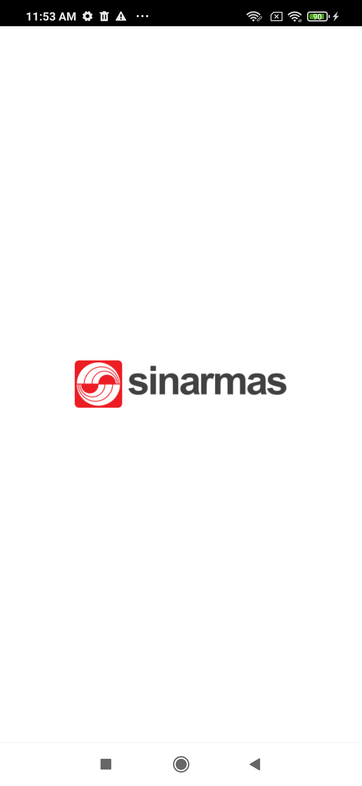
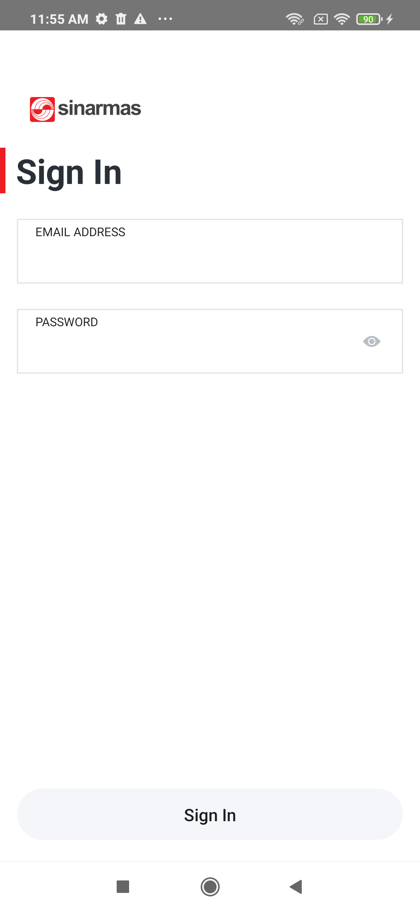
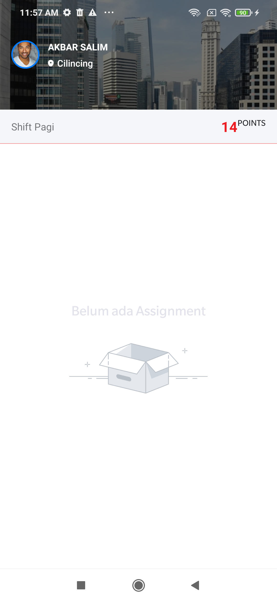
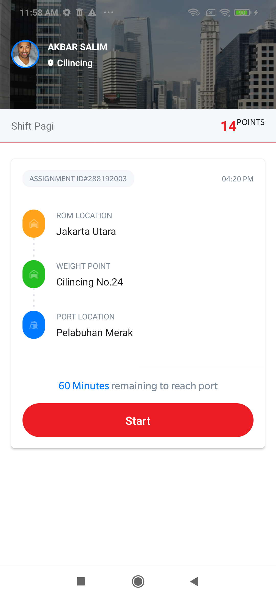
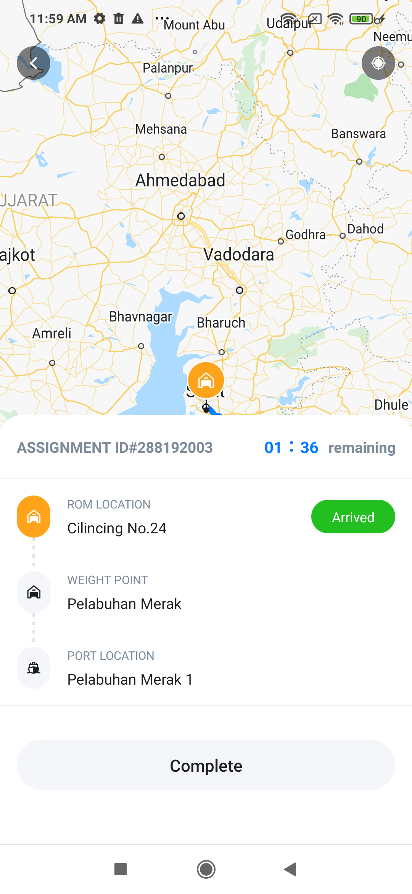
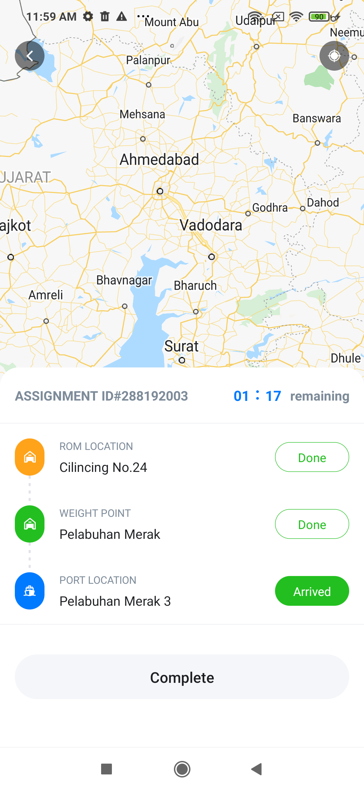
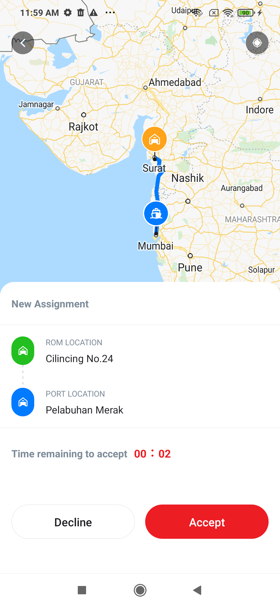

# Sinarmas Track App

 In this tutorial, we'll make a small sinarmas tracking with location app.
  

 

    
    
    
    
    
    
                                                                                           

     

                                                                                                
Running the project

 
Assuming you have all the requirements installed, you can setup and run the project:

Below following steps for your platform
* yarn install 
* yarn start

Run on Android device/emulator or i to run on iOS simulator

Android
- npx react-native run-android

IOS
- npx react-native run-ios
